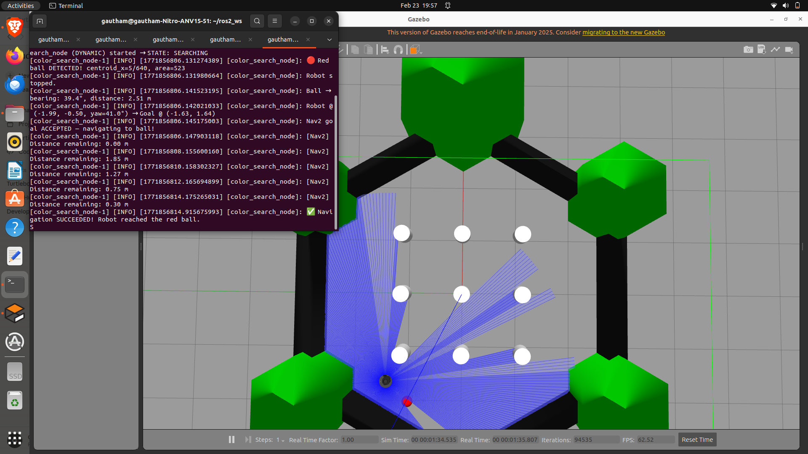

# 🤖 ROS 2 Red Ball Detection & Navigation
### TurtleBot3 Burger | ROS 2 Humble | OpenCV | Nav2 | Gazebo

A ROS 2 autonomous navigation project where a **TurtleBot3 Burger** robot searches for a red ball using real-time OpenCV color detection, computes the ball's exact position using LiDAR and AMCL localisation, and navigates to it using the Nav2 stack.

---

## Demo



https://github.com/GauthamCodes/red_ball_nav/blob/main/media/demo.webm

---

## How It Works

The robot runs through 3 states automatically:

```
SEARCHING → (red detected) → DETECTED → (goal sent) → NAVIGATING → DONE
```

| State | What the robot does |
|---|---|
| **SEARCHING** | Rotates at 0.4 rad/s while OpenCV scans every camera frame for red |
| **DETECTED** | Stops immediately, computes ball's real map coordinates |
| **NAVIGATING** | Nav2 drives the robot to the ball's actual location |
| **DONE** | Task complete |

### Dynamic Position Calculation
Rather than navigating to a hardcoded location, the robot computes the ball's **real world coordinates** every run using:
- **Camera** → pixel centroid of red blob → bearing angle to ball
- **LiDAR** → distance to ball in that direction
- **AMCL** → robot's current position and orientation on the map

---

## Package Structure

```
red_ball_nav/
├── red_ball_nav/
│   ├── color_search_node.py   ← Main node (search + detect + navigate)
│   └── red_ball.sdf           ← Gazebo red ball model
├── launch/
│   ├── red_ball_nav.launch.py ← Full launch (Gazebo + Nav2 + node)
│   └── node_only.launch.py    ← Node only (for step-by-step testing)
├── media/
│   ├── gazebo_world.png       ← Screenshot of robot reaching ball
│   └── demo.webm              ← Demo video
├── package.xml
├── setup.py
└── README.md
```

---

## Prerequisites

```bash
# TurtleBot3 (build from source — apt packages may be unavailable)
cd ~/ros2_ws/src
git clone -b humble https://github.com/ROBOTIS-GIT/turtlebot3.git
git clone -b humble https://github.com/ROBOTIS-GIT/turtlebot3_simulations.git
git clone -b humble https://github.com/ROBOTIS-GIT/turtlebot3_msgs.git

# Nav2
sudo apt install ros-humble-navigation2 ros-humble-nav2-bringup

# Python dependencies
sudo apt install python3-opencv ros-humble-cv-bridge

# Add to ~/.bashrc
echo "source /opt/ros/humble/setup.bash" >> ~/.bashrc
echo "source ~/ros2_ws/install/setup.bash" >> ~/.bashrc
echo "export TURTLEBOT3_MODEL=burger" >> ~/.bashrc
source ~/.bashrc
```

> **Note:** The TurtleBot3 Burger does not include a camera by default. A camera link and Gazebo plugin were manually added to the robot's SDF model file to enable `/camera/image_raw` at 30Hz.

---

## Build

```bash
cd ~/ros2_ws
colcon build --packages-select red_ball_nav
source install/setup.bash
```

---

## Launch Sequence

Open 5 terminals. Run these in order:

**Terminal 1 — Gazebo:**
```bash
ros2 launch turtlebot3_gazebo turtlebot3_world.launch.py
```
> Wait until the robot appears upright in Gazebo.

**Terminal 2 — Spawn red ball:**
```bash
ros2 run gazebo_ros spawn_entity.py \
    -entity red_ball \
    -file ~/ros2_ws/src/red_ball_nav/red_ball_nav/red_ball.sdf \
    -x -2.0 -y 1.0 -z 0.1
```

**Terminal 3 — Nav2:**
```bash
ros2 launch nav2_bringup bringup_launch.py use_sim_time:=true \
    map:=/opt/ros/humble/share/nav2_bringup/maps/turtlebot3_world.yaml \
    use_rviz:=true
```
> Wait until RViz opens and the map appears.

**Terminal 4 — Set initial robot pose:**
```bash
ros2 topic pub /initialpose geometry_msgs/msg/PoseWithCovarianceStamped \
"{header: {frame_id: 'map'}, pose: {pose: {position: {x: -2.0, y: -0.5, z: 0.0}, orientation: {x: 0.0, y: 0.0, z: 0.0, w: 1.0}}}}" --once
```
> Wait for Terminal 3 to print: `Managed nodes are active`

**Terminal 5 — Run the node:**
```bash
ros2 launch red_ball_nav node_only.launch.py stop_distance:=0.15
```

---

## Expected Output

```
[color_search_node]: color_search_node (DYNAMIC) started → STATE: SEARCHING
[color_search_node]: 🔴 Red ball DETECTED! centroid_x=7/640, area=716
[color_search_node]: Robot stopped.
[color_search_node]: Ball → bearing: 39.1°, distance: 1.97 m
[color_search_node]: Robot @ (-1.99, -0.50, yaw=41.0°) → Goal @ (-1.63, 1.64)
[color_search_node]: Nav2 goal ACCEPTED — navigating to ball!
[color_search_node]: [Nav2] Distance remaining: 1.85 m
[color_search_node]: [Nav2] Distance remaining: 0.30 m
[color_search_node]: ✅ Navigation SUCCEEDED! Robot reached the red ball.
```

---

## Tunable Parameters

Pass these directly in the Terminal 5 launch command:

| Parameter | Default | Description |
|---|---|---|
| `stop_distance` | 0.15 | Meters to stop in front of ball |
| `rotate_speed` | 0.4 | Angular velocity while searching (rad/s) |
| `min_contour_area` | 300 | Minimum red blob size (pixels²) to confirm detection |

Example:
```bash
ros2 launch red_ball_nav node_only.launch.py stop_distance:=0.05 rotate_speed:=0.3
```

---

## ROS 2 Topics Used

| Topic | Type | Role |
|---|---|---|
| `/camera/image_raw` | `sensor_msgs/Image` | Subscribed — camera frames for OpenCV |
| `/scan` | `sensor_msgs/LaserScan` | Subscribed — LiDAR distance measurement |
| `/amcl_pose` | `geometry_msgs/PoseWithCovarianceStamped` | Subscribed — robot position on map |
| `/cmd_vel` | `geometry_msgs/Twist` | Published — rotation and stop commands |
| `/navigate_to_pose` | `nav2_msgs/NavigateToPose` | Action client — sends goal to Nav2 |

---

## Common Issues

| Problem | Fix |
|---|---|
| `Goal REJECTED` and robot at (0,0) | Run Terminal 4 again after Nav2 is fully active |
| Camera topic not publishing | Check SDF camera plugin is correctly added to model |
| Robot rotates forever | Ball may be behind a pillar — respawn at different coordinates |
| Invalid XML on spawn | Run `xmllint --noout` on the burger model.sdf and fix errors |
